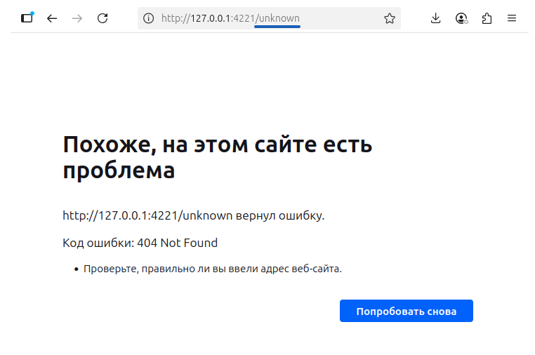

#Basic HTTP Server | C, TCP/IP

– Базовый HTTP-сервер на TCP/IP, который обрабатывает и парсит GET-запросы (метод, путь  и заголовки) и возвращающает соответствующие коды ответа с поддержкой одновременных подключений клиента (concurrent connections).

*В ранних коммитах есть версия проекта без одновременных подлючений.

## Инструкция для запуска

```bash
make
```
## Для тестирования одновременных подключений:
```bash
./test.sh
```
## Пример работы
Ниже представлен результат работы GET-запроса с рандомным словом в пути


## Ошибка Bind failed: Address already in use 

Если работа сервера была завершена некорректно, например, Ctrl + C, сделайте следующее:
```bash
sudo lsof -i :4221 - узнать PID
sudo kill -9 48220 - убить PID
```